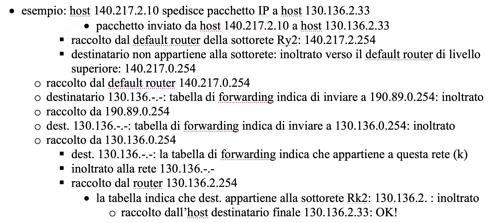

# Forwarding dei pacchetti

# Simulazione

In questa lezione/esercitazione faremo _role-playing_ e ci immedesimeremo in un router per fare instradamento (forwarding) di pacchetti.

- Esempio - schema
  L'indentazione non è casuale ma gerarchica: router allo stesso livello di indentazione si parlano come pari.
  
- Esempio - rappresentazione grafica
  

# Traccia

Vogliamo tracciare la spedizione del pacchetto da `140.217.2.10` (mittente) a `130.136.2.33` (destinatario). Come possiamo vedere dalla [figura](assets/routing-esempio-rappresentazione-grafica.png), il pacchetto dovrà salire di livello fino ai router che fanno parte della backbone di internet e poi dovrà riscendere in basso verso la destinazione.

# Svolgimento

Per semplicità durante lo svolgimento scriveremo la parte rete degli indirizzi IP in decimale e la parte host, quella su cui lavoreremo, in binario.

## Ry2

Il default router della rete mittente è `140.217.2.254` (def. router della subnet 2).

Il router quindi riceve il pacchetto e controlla se è destinato ad un host nella stessa rete o se è da mandare fuori.

```
140.217.00000010.11111110 (ind ip del default router rete 2 - mittente)
255.255.11111111.00000000 (netmask del def. router rete 2)
&&
140.217.00000010.-------- = 1* (questa è la rete/sottorete del def. router)
```

> Domanda: il router si chiede, `il pacchetto proviene dalla mia subnet?` (domanda opzionale, la svolgiamo comunque a titolo di esempio).

```
140.217.00000010.00001010 (140.217.2.10, ind. mittente)
255.255.11111111.00000000 (netmask del router)
&&
140.217.00000010.-------- = 2*
```

Il router quindi concretamente si chiede se il risultato 1* e il risultato 2* sono uguali:

- `1* == 2* ?`;

> Domanda: (**importante**) a chi è destinato il pacchetto?

```
130.136.00000010.00100001 (130.136.2.33, ind. destinazione)
255.255.11111111.00000000 (netmask del router /24)
&&
130.136.00000010.-------- = *3
```

La rete/subnet del destinatario è la mia rete (del router)?
Ovvero: `2* == 3* ?`.

No, quindi il pacchetto va gestito come "per tutte le altre destinazioni" e viene mandato al router in alto nella gerarchia.

## Ry

Quindi adesso impersoniamo il router superiore, quello della rete Ry.

Il default router di Ry fa esattamente lo stesso procedimento appena visto, in quanto è sempre un router. Per andare più rapidi ci riponiamo solo la seconda domanda.

> Domanda: a chi è destinato il pacchetto?

```
130.136.00000010.00100001 (130.136.2.33, ind. destinazione)
255.255.00000000.00000000 (255.255.0.0 netmask del router Ry, /16)
&&
130.136.--------.-------- = 4*
```

Calcoliamo quindi la rete di Ry:

```
140.217.0.254 / 16 (IP di Ry)
255.255.0.0        (netmask di Ry)
&&
140.217.-.-   = 5*
```

Quindi ora, come al solito, ci chiediamo: `4* == 5* ?`.

Chiaramente no, quindi spediamo il pacchetto al livello superiore.

> Non c'è un livello superiore, il router di Ry fa parte della backbone di internet, quindi comunica con gli altri router fra pari, non gerarchicamente.

Qui entrano in gioco le tabelle di instradamento. Per questo esercizio le tabelle sono quelle indicate in [figura](https://www.notion.so/Forwarding-dei-pacchetti-f4f175479b1e444b9fd866c343b8d655) sopra ogni router.

I router della backbone reale usano Tabelle di Instradamento più complesse chiaramente.

Nella tabella di instradamento troviamo le indicazioni per arrivare a destinazione, nello specifico la tabella di Ry dice che i pacchetti destinati a 130.136.0.0 vanno mandati a Rz.

Mandiamo il pacchetto a Rz, il compito di Ry è finito.

## Rz

Ora siamo il router di Rz. Riceviamo un pacchetto da Ry. Facciamo le solite operazioni:

```
190.89.0.254 /16 (ind. ip del router Rz)
255.255.0.0      (netmask del router Rz)
&&
190.89.0.0.  /16  = 6* (è la rete del router Rz)
```

Calcoliamo l'indirizzo della rete del destinatario:

```
130.136.2.33   (ind. destinatario)
255.255.0.0    (netmask di Rz)
&&
130.136.0.0   = 7*
```

Quindi ci chiediamo: `6* == 7* ?`

No, quindi il pacchetto non va inviato in basso ma altrove. Dalle tabelle di instradamento vediamo che dobbiamo spedirlo a destra, verso Rk.

## Rk

Ora siamo Rk. Dobbiamo capire se il pacchetto è per un nostro host o no.

Quindi come al solito Rk prende il suo indirizzo IP e fa l'operazione di AND con la netmask.

```
130.136.0.254 /16 (IP di Rk)
255.255.0.0       (netmask di Rk)
&&
130.136.-.-       = 8* (è la rete di Rk)
```

il destinatario del pacchetto è l'indirizzo IP 130.136.2.33

```
130.136.2.33  (IP dest)
255.22.0.0    (netmask)
&&
130.136.-.-   = 9* (rete del destinatario)
```

A questo punto facciamo il solito controllo: `8* == 9* ?` Sì.
Quindi il pacchetto è arrivato a destinazione e Rz deve ora inoltrarlo alla rete "per la città" (rete locale destinazione).

## Interludio

Immaginiamo (attenzione, non accade realmente, stiamo ipotizzando a fini didattici!) che il pacchetto venga inviato in broadcast a tutti gli host sotto Rk, quindi che arrivi a Rk1, Rk2, Rk3, ecc.

Vediamo come ipoteticamente agirebbero i tre router Rk1, Rk2, Rk3 qualora ricevessero il pacchetto da Rk.

### Rk1

Rk1 si calcola il suo indirizzo di rete e sottorete:

```
130.136.1.254 /24 (Indirizzo di Rk1)
255.255.255.0     (netmask di Rk1)
&&
130.136.1.-       = 10*
```

Fa la stessa operazione per l'indirizzo del pacchetto:

```
130.136.2.33   (indirizzo dest.)
255.255.255.0  (sempre la netmask di Rk1)
&&
130.136.2.-    = 11*
```

Rk1 si chiede quindi: `10* == 11* ?` No, quindi ignora il pacchetto e non fa nulla.

L'unica cosa che potrebbe fare Rk1 con un pacchetto che non è suo sarebbe mandarlo a Rk, il default router, ma non lo fa perché Rk1 manda a Rk solo i pacchetti nati nella sua sottorete.

Similmente si comporta Rk3.

## Torniamo a noi: Rk2

Vediamo le operazioni che fa Rk2:

```
130.136.2.254 (indirizzo IP di Rk2)
255.255.255.0 (netmask di Rk2)
&&
130.136.2.-   = 12*
```

```
130.136.2.33  (indirizzo dest.)
255.255.255.0 (netmask di rk2)
&&
130.136.2.-   = 13*
```

Quindi Rk2 si chiede: `12* == 13* ?` Sì.

Quindi il pacchetto è arrivato alla rete e viene inoltrato alla subnet sotto Rk2 al destinatario con indirizzo `130.136.2.33`.

### Come invio al destinatario?

Ci serve sapere l'indirizzo MAC della scheda di rete che corrisponde all'indirizzo IP `130.136.2.33`.
Per fare questa operazione si utilizzano il protocollo ARP e la ARP Table, che però non rientrano nello scopo di questo esercizio.

[Progettazione completa di domini IP](./appunti-andrea-bianchi-esercitazione-progettazione-domini-ip.md)
